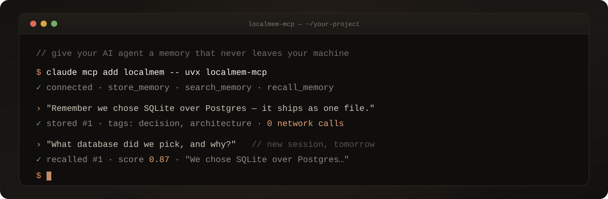
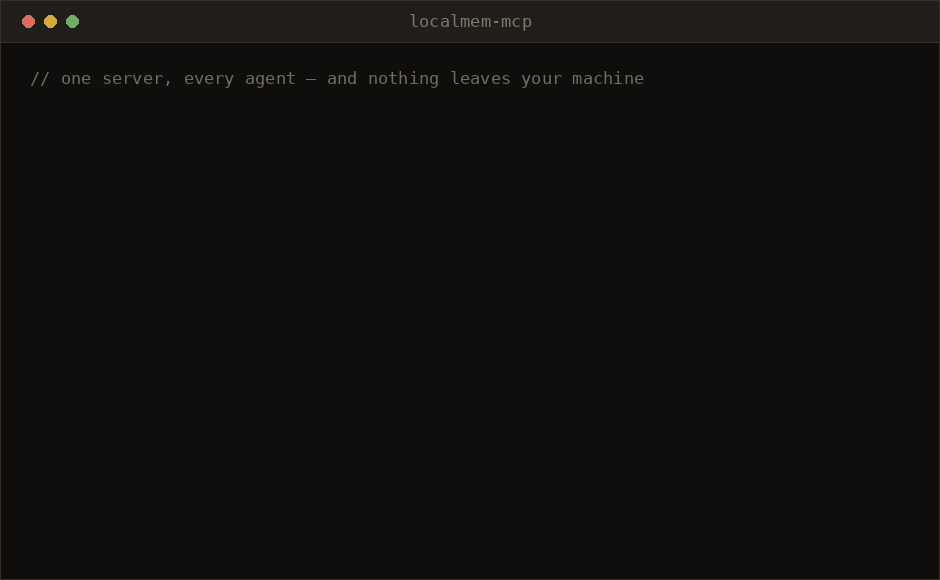

<div align="center">



[](https://github.com/OpenAgentHQ/localmem-mcp/actions/workflows/ci.yml)
[](https://pypi.org/project/localmem-mcp/)
[](https://pypi.org/project/localmem-mcp/)
[](LICENSE)
[](https://modelcontextprotocol.io)
[](https://openagenthq.github.io/localmem-mcp/)
[](#privacy)

Just SQLite and local embeddings.

**[📖 Read the docs →](https://openagenthq.github.io/localmem-mcp/)**



</div>

---

## Quickstart (30 seconds)

**1. Add it to your MCP client.** No install step — `uvx` fetches and runs it:

```jsonc
// Claude Desktop: claude_desktop_config.json
// Cursor:         .cursor/mcp.json
// Claude Code:    claude mcp add localmem -- uvx localmem-mcp
{
  "mcpServers": {
    "localmem": {
      "command": "uvx",
      "args": ["localmem-mcp"]
    }
  }
}
```

**2. Restart the client and talk to it:**

> "Remember that we chose SQLite over Postgres for this project because it ships in a single file."

…then, in a completely new session tomorrow:

> "What database did we pick, and why?"

That's it. Your agent now remembers, and nothing left your laptop.

<details>
<summary>Prefer a normal install?</summary>

```bash
pip install localmem-mcp     # then use "command": "localmem-mcp" in the config above
```

</details>

<details>
<summary>Using a different coding agent?</summary>

The config above covers most clients, but several agents want a different shape —
and get it wrong silently. VS Code's root key is `servers`; Codex uses TOML;
OpenCode and Kilo Code take `command` as an array; Goose calls them extensions;
Zed nests them under `context_servers`.

**[Integrations →](https://openagenthq.github.io/localmem-mcp/integrations/)** has
the verified config for 20+ agents: Claude Code, Codex, Gemini CLI, Copilot CLI,
Goose, OpenCode, Crush, Amp, Amazon Q, Qwen Code, Junie, Antigravity, Warp,
Cursor, Windsurf, Zed, VS Code, JetBrains, Trae, Cline, Roo Code, Kilo Code,
Continue, and Claude Desktop.

</details>

## The three tools

| Tool | What the agent uses it for |
| --- | --- |
| `store_memory` | Save a durable fact, decision, or preference — with optional tags. |
| `search_memory` | Find memories by **meaning**, not keywords. "which database?" finds "we went with SQLite". |
| `recall_memory` | Re-read a specific memory by id, or catch up on the most recent ones. |

Plus `memory_stats` for where the database lives and how much is in it.

## Also a Python library

The MCP server is a thin shell over a store you can import directly:

```python
from localmem_mcp import MemoryStore

store = MemoryStore()  # ~/.localmem/memories.db
store.add("We chose SQLite over Postgres", tags=["decision", "architecture"])

for hit in store.search("what database are we using?"):
    print(hit.score, hit.memory.content)
```

And a CLI, for when you just want to look:

```bash
localmem-mcp add "Deploys go out on Thursdays" --tag ops
localmem-mcp search "when do we ship?"
localmem-mcp recall -n 5
localmem-mcp stats
localmem-mcp export > memories.jsonl     # take your memories elsewhere
localmem-mcp import memories.jsonl
```

## Privacy

Nothing is sent anywhere. Memories live in one SQLite file you own, and
embeddings are computed on-device with [fastembed](https://github.com/qdrant/fastembed).
The only network request the package ever makes is the one-time download of the
embedding model (~90 MB, from Hugging Face) on first use — after that it works
fully offline. Delete `~/.localmem/memories.db` and the memory is gone.

## Why localmem-mcp

The privacy pitch is the headline, but the cost story matters just as much:
recall never calls an LLM. `search_memory` is local cosine similarity plus an
FTS5 keyword bonus, both computed on-device — no tokens spent, no round trip,
no per-call bill, whether you store ten memories or ten thousand. Most memory
tools in this space run an LLM on the way in *and* the way out; localmem-mcp
only ever runs the embedding model, locally, and only on the way in.

| | **localmem-mcp** | OpenMemory MCP (Mem0) | mem0-mcp-server | Zep / Graphiti |
| --- | --- | --- | --- | --- |
| Cloud calls | Zero, ever, after the one-time model download | Yes — LLM call to extract facts | Yes — hosted Mem0 platform | Yes — LLM call to build/update the graph |
| API key required | None | `OPENAI_API_KEY` | `MEM0_API_KEY` | An LLM provider key |
| LLM on the recall path | No — cosine similarity + FTS5, both local | Yes — LLM involved in storing and recalling | Yes — hosted LLM involved in storing and recalling | Yes — LLM traverses/summarizes the graph |
| Install footprint | `pip install localmem-mcp` / `uvx localmem-mcp`, no other services | Docker Compose stack (API + vector DB) | Package + a hosted Mem0 account | Self-hosted graph DB + LLM, or hosted Zep Cloud |
| Datastore | One SQLite file | Qdrant (vector DB) + a history DB | Mem0's hosted store | Neo4j / FalkorDB (graph DB) |

Based on each project's own setup docs as of August 2026 — verify against
their READMEs before deciding, since requirements like these change fast.
None of this makes the others *wrong*: a temporal knowledge graph or
LLM-extracted facts are real capabilities localmem-mcp doesn't have. The
trade is deliberate — this project stays a SQLite file and an embedding
model, on purpose, rather than growing into an agent framework or a hosted
service. See [ROADMAP.md](ROADMAP.md) for where the line is drawn.

## Architecture

```
MCP client (Claude Code, Cursor, Claude Desktop, OpenClaw…)
        │  stdio / JSON-RPC
        ▼
  server.py    FastMCP — store_memory · search_memory · recall_memory
        ▼
  store.py     MemoryStore
        ├── SQLite  memories table + FTS5 index      (durable, single file)
        └── fastembed  ONNX embeddings, lazy-loaded  (on-device, 384-dim)
```

Search is **hybrid**: every memory is scored by cosine similarity against the
query embedding, and memories that also hit the FTS5 keyword index get a bounded
bonus — so paraphrases are found *and* exact terms like error codes or names
aren't lost. Embeddings are stored as `float32` blobs alongside the text, so a
memory is one row and there is no second datastore to keep in sync.

The model loads lazily on the first store/search call, which keeps server
startup near-instant for clients that spawn it eagerly.

## Configuration

| Environment variable | Default | Purpose |
| --- | --- | --- |
| `LOCALMEM_DB_PATH` | `~/.localmem/memories.db` | Full path to the SQLite file. |
| `LOCALMEM_HOME` | `~/.localmem` | Directory used when `LOCALMEM_DB_PATH` is unset. |
| `LOCALMEM_MODEL` | `BAAI/bge-small-en-v1.5` | Any model name supported by fastembed. |

Point separate projects at separate databases with `--db` or `LOCALMEM_DB_PATH`.

## Star History

<a href="https://star-history.com/#OpenAgentHQ/localmem-mcp&Date">
  <picture>
    <source media="(prefers-color-scheme: dark)" srcset="https://api.star-history.com/svg?repos=OpenAgentHQ/localmem-mcp&type=Date&theme=dark" />
    <source media="(prefers-color-scheme: light)" srcset="https://api.star-history.com/svg?repos=OpenAgentHQ/localmem-mcp&type=Date" />
    
  </picture>
</a>

## Contributing

Issues and PRs are welcome, and the project is deliberately small enough to read
in one sitting — `store.py` is the whole thing, and everything else is a shell
over it.

```bash
git clone https://github.com/OpenAgentHQ/localmem-mcp && cd localmem-mcp
python -m venv .venv && .venv/bin/pip install -e ".[dev]"
.venv/bin/python -m pytest -q        # offline, about a second
```

[CONTRIBUTING.md](CONTRIBUTING.md) covers the layout, the testing approach, and
what does and doesn't fit the project.
[Good first issues](https://github.com/OpenAgentHQ/localmem-mcp/labels/good%20first%20issue)
are scoped to be approachable without deep context.

- [Code of Conduct](CODE_OF_CONDUCT.md)
- [Security policy](SECURITY.md) — report vulnerabilities privately, please

## License

[MIT](LICENSE)
