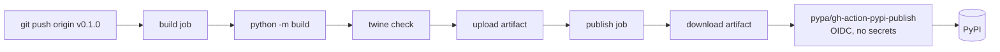

# Releasing

How localmem-mcp gets from `main` to PyPI. Maintainers only — contributors don't
need any of this.

Releases are cut by pushing a tag. Everything else is automated:
`.github/workflows/release.yml` builds the distributions and publishes them via
PyPI Trusted Publishing (OIDC). **There are no tokens or secrets to manage.**

## Versioning

[Semantic Versioning](https://semver.org/spec/v2.0.0.html), with the usual
pre-1.0 caveat: while the version starts with `0.`, minor bumps may carry
breaking changes. Patch releases never do.

What counts as breaking here is broader than the Python API alone, because this
package has four surfaces users depend on:

| Surface | Breaking looks like |
| --- | --- |
| **MCP tools** | Renaming a tool, removing an argument, or changing what a return field means. **Also a materially rewritten docstring** — models read those to decide when to call a tool, so a rewrite changes behaviour even when the signature is untouched. |
| **SQLite schema** | Any change an existing database can't be read by. A release that can't open a database written by the previous version is breaking, no exceptions. |
| **CLI** | Renaming a subcommand or flag, or changing output shape under `--json`. Human-readable output is not a contract. |
| **Python API** | The usual: signatures and behaviour of `MemoryStore`, `Memory`, `SearchResult`, and `Embedder`. |

Search ranking sits outside this table on purpose. Better results are the point
of the project, so ranking changes ship in minor releases — but the changelog
must say what moved and in which direction.

## Before you tag

1. **`main` is green.** Check the CI run for the commit you're about to tag —
   all four jobs, including the integration job that exercises real fastembed
   embeddings.
2. **The changelog is ready.** Rename `## [0.1.0] — unreleased` to
   `## [0.1.0] — YYYY-MM-DD`, add a fresh empty `## [Unreleased]` above it, and
   check the link definitions at the bottom point at the right tags.
3. **The version matches.** `version` in `pyproject.toml` must equal the tag you
   are about to push, without the `v`.
4. **Sanity-check the build locally:**

   ```bash
   python -m build
   python -m twine check dist/*
   pip install dist/localmem_mcp-*.whl   # in a scratch venv
   localmem-mcp --version
   ```

## Cutting the release

Version bump and changelog go through a normal PR — never push to `main`
directly.

```bash
git checkout main && git pull
git checkout -b claude/release-0.1.0
# bump version in pyproject.toml, finalize CHANGELOG.md
git commit -am "Release 0.1.0"
git push -u origin claude/release-0.1.0
# open the PR, get it green, merge
```

Then tag the merge commit on `main`:

```bash
git checkout main && git pull
git tag -a v0.1.0 -m "v0.1.0"
git push origin v0.1.0
```

Pushing the tag is what triggers the release. The tag must start with `v`; the
workflow only listens for `v*`.

## What the workflow does



The split into two jobs is deliberate: metadata problems fail at `twine check`,
before anything is uploadable. The publish job is the only one with
`id-token: write`, and it's scoped to the `pypi` environment.

`workflow_dispatch` is also enabled, which is useful for re-running a publish
after a transient failure — but note it builds from the branch you dispatch it
on, not from a tag.

## After the release

1. **Confirm it's live:** <https://pypi.org/project/localmem-mcp/>
2. **Install it clean**, in a fresh environment:

   ```bash
   uvx localmem-mcp --version
   ```

3. **Cut a GitHub Release** for the tag, with the changelog section as the body.
4. **Check the docs deployed** — <https://openagenthq.github.io/localmem-mcp/>
   publishes from `main`, so it will already reflect the release.

## When something goes wrong

**A version cannot be replaced on PyPI.** Uploading `0.1.0` a second time fails,
even after deleting it. Fixing a bad release means shipping a new version.

- **Bad release, already published** → fix forward. Bump the patch version, ship
  `0.1.1`, and yank the bad version on PyPI. Yanking hides it from new
  installs while leaving existing pins working.
- **Publish failed after the tag was pushed** → check the run logs. If it never
  reached PyPI, fix the problem and re-run the workflow; if the version did land,
  treat it as published and fix forward.
- **Tag pushed by mistake, nothing published** → delete it locally and remotely
  (`git tag -d v0.1.0 && git push --delete origin v0.1.0`), then re-tag. Only
  safe while nothing has been published under that version.

## Prerequisites, one time

These are already configured, and are recorded here because they're invisible
until they break:

- **PyPI trusted publisher** for the `localmem-mcp` project, pointing at this
  repository and the workflow file **`release.yml`**. The filename is part of
  the trust relationship — renaming the workflow breaks publishing.
- **A `pypi` GitHub environment** on the repository. The publish job targets it,
  and the job will not start without it.
