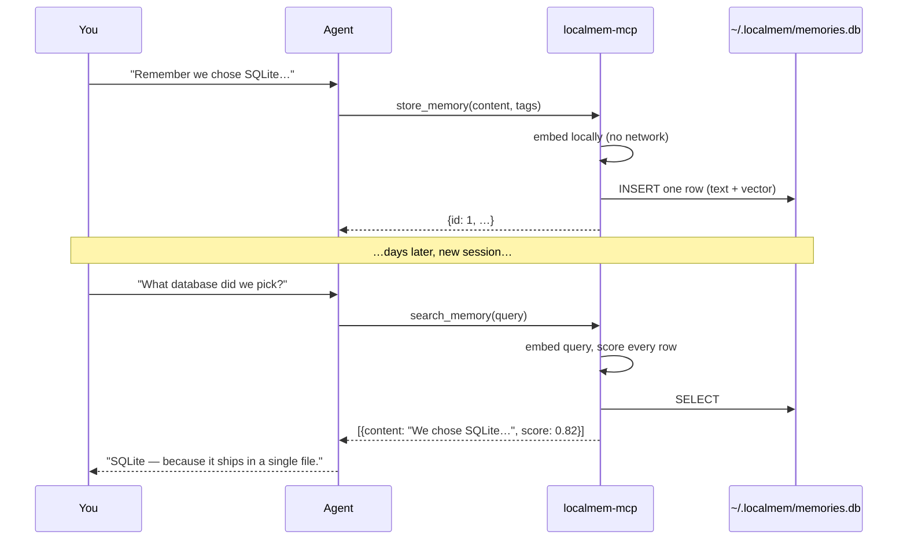

# Quickstart

From nothing to an agent with memory, in about 30 seconds.

## 1. Add it to your client

No install step — `uvx` fetches and runs it:

```json title="claude_desktop_config.json / .cursor/mcp.json"
{
  "mcpServers": {
    "localmem": {
      "command": "uvx",
      "args": ["localmem-mcp"]
    }
  }
}
```

For Claude Code, one command does it:

```bash
claude mcp add localmem -- uvx localmem-mcp
```

Other clients are covered in [Connect your client](clients.md).

## 2. Restart the client

MCP servers are picked up at startup, so a full restart is needed — not just a
new conversation.

To confirm it's connected, ask your agent:

> "What memory tools do you have available?"

It should list `store_memory`, `search_memory`, and `recall_memory`.

## 3. Store something

> "Remember that we chose SQLite over Postgres for this project because it ships
> in a single file and needs no server."

The agent calls `store_memory`. Behind the scenes, the text is embedded locally
and written as one row in `~/.localmem/memories.db`.

!!! note "The first call is slower"

    This is when the embedding model downloads (~90 MB, once). Every call after
    it is fast and fully offline.

## 4. Recall it in a completely new session

Close the conversation. Start a fresh one tomorrow, next week, whenever:

> "What database did we pick for this project, and why?"

The agent calls `search_memory` and gets the memory back — even though you never
said "SQLite" in the new session. That's semantic search: it matches meaning,
not words.

## What just happened



Nothing left your machine at any point.

## Try it without an agent

The CLI talks to the same database, which is handy for checking what your agent
has been remembering:

```bash
localmem-mcp add "Deploys go out on Thursdays" --tag ops
localmem-mcp search "when do we ship?"
localmem-mcp recall -n 5
localmem-mcp stats
```

## Next steps

- [Connect your client](clients.md) — configs for Cursor, Zed, Windsurf, and more
- [MCP tools](../guide/mcp-tools.md) — every tool and argument
- [Configuration](../guide/configuration.md) — per-project databases, model choice
- [How search works](../guide/how-search-works.md) — why it finds what it finds

## Getting good results

A few things that make agent memory noticeably better:

!!! tip "Tell the agent *when* to remember"

    Most agents won't store memories unprompted. A line in your project
    instructions helps:

    > "Use `store_memory` to save durable decisions, preferences, and project
    > context. Search your memory before asking me something I may have already
    > told you."

!!! tip "Prefer self-contained memories"

    "Use the staging bucket" is useless in six months. "Deploy artifacts go to
    the `acme-staging` S3 bucket, not `acme-prod`" survives on its own.

!!! tip "Use tags for separate contexts"

    Tag by project or area (`--tag project-x`, `--tag preference`), then filter
    searches to them. Or keep separate databases entirely — see
    [Configuration](../guide/configuration.md).
