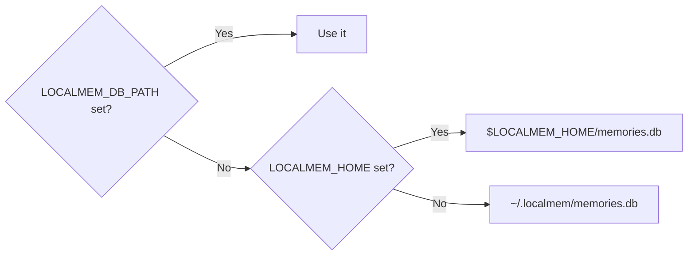

# Configuration

localmem-mcp works with no configuration at all. When you do need to change
something, there are three environment variables and their CLI equivalents.

## Environment variables

| Variable | Default | Purpose |
| --- | --- | --- |
| `LOCALMEM_DB_PATH` | `~/.localmem/memories.db` | Full path to the SQLite file. |
| `LOCALMEM_HOME` | `~/.localmem` | Directory used when `LOCALMEM_DB_PATH` is unset. |
| `LOCALMEM_MODEL` | `BAAI/bge-small-en-v1.5` | Any fastembed-supported model. |

Resolution order for the database location:



Paths are expanded, so `~` works. Parent directories are created on demand.

## CLI flags

Every command accepts the same overrides, which take precedence over the
environment:

```bash
localmem-mcp --db ./project.db --model BAAI/bge-base-en-v1.5 search "deploys"
```

| Flag | Equivalent |
| --- | --- |
| `--db PATH` | `LOCALMEM_DB_PATH` |
| `--model NAME` | `LOCALMEM_MODEL` |

## Per-project memory

One shared memory across everything is a reasonable default — you probably do
want your agent to remember your preferences everywhere. But project context is
often better kept separate, so unrelated work doesn't pollute search results.

=== "Via client args"

    ```json
    {
      "mcpServers": {
        "localmem": {
          "command": "uvx",
          "args": ["localmem-mcp", "--db", "/Users/you/code/acme/.localmem.db"]
        }
      }
    }
    ```

=== "Via environment"

    ```json
    {
      "mcpServers": {
        "localmem": {
          "command": "uvx",
          "args": ["localmem-mcp"],
          "env": { "LOCALMEM_DB_PATH": "/Users/you/code/acme/.localmem.db" }
        }
      }
    }
    ```

=== "Two servers at once"

    Nothing stops you running both — a shared one for preferences and a
    project-scoped one for context:

    ```json
    {
      "mcpServers": {
        "memory-global": {
          "command": "uvx",
          "args": ["localmem-mcp"]
        },
        "memory-project": {
          "command": "uvx",
          "args": ["localmem-mcp", "--db", "./.localmem.db"]
        }
      }
    }
    ```

    The agent sees two sets of tools and picks between them. Give them clearly
    distinct names so it chooses sensibly.

!!! tip "Add project databases to `.gitignore`"

    ```gitignore
    .localmem.db
    .localmem.db-wal
    .localmem.db-shm
    ```

    The WAL and shared-memory files are SQLite's, and appear alongside the
    database while it's in use.

## Choosing a different model

Any model from the
[fastembed supported list](https://qdrant.github.io/fastembed/examples/Supported_Models/):

```bash
export LOCALMEM_MODEL="BAAI/bge-base-en-v1.5"
```

Trade-offs worth knowing:

| Model | Dimensions | Size | Notes |
| --- | --- | --- | --- |
| `BAAI/bge-small-en-v1.5` | 384 | ~90 MB | Default. Best balance for English. |
| `BAAI/bge-base-en-v1.5` | 768 | ~230 MB | Better quality, slower cold start. |
| `sentence-transformers/paraphrase-multilingual-MiniLM-L12-v2` | 384 | ~450 MB | Multilingual. |

!!! warning "Switching models invalidates existing embeddings"

    Vectors from different models aren't comparable. localmem stores the model
    name and dimension per row and scores mismatched dimensions as `0.0`, so
    results degrade rather than silently mislead — but existing memories will
    stop matching.

    If you switch, start a new database or re-store your memories.

## Where things end up

```
~/.localmem/
  memories.db          your memories
  memories.db-wal      SQLite write-ahead log
  memories.db-shm      SQLite shared memory

~/.cache/fastembed/    the downloaded ONNX model
```

The `-wal` and `-shm` files appear because the database runs in WAL mode, which
lets a CLI command read while a server holds the file open. They're managed by
SQLite; don't delete them separately from the database.

## Checking your configuration

```bash
localmem-mcp stats
```

```
db: /Users/you/.localmem/memories.db
memories: 42
model: BAAI/bge-small-en-v1.5
```

This is the first thing to run when memories seem to be missing — most often the
client and your terminal are pointed at different databases.
