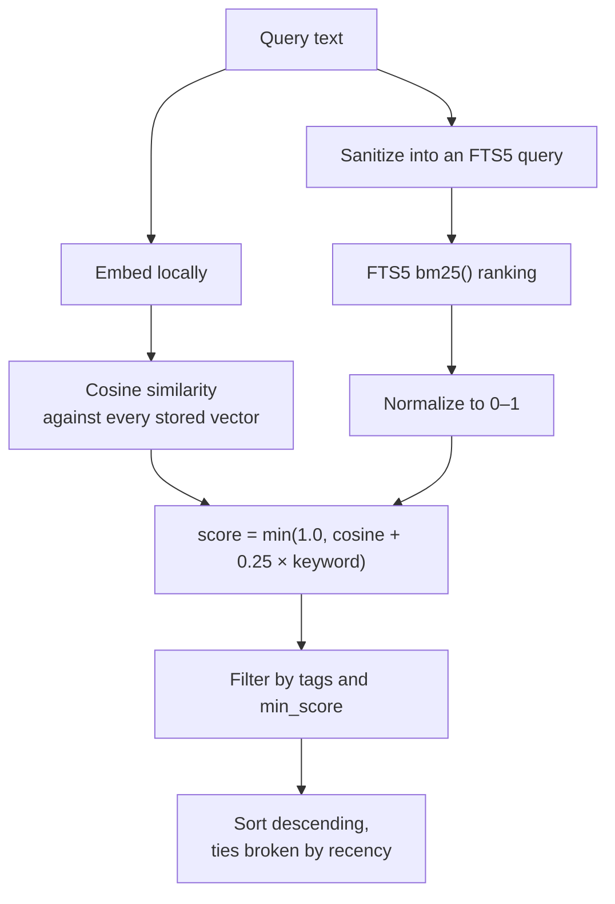

# How search works

Search is **hybrid**: it blends a dense signal (embedding similarity, which
catches paraphrase) with a sparse one (keyword matching, which catches exact
terms). Neither alone is good enough for memory.

## The pipeline



1. **Embed the query** with the same local model used when storing.
2. **Score every row** by cosine similarity against the query vector.
3. **Query FTS5** for keyword hits and normalize `bm25()` ranks into `[0, 1]`.
4. **Blend**: `score = min(1.0, cosine + 0.25 × keyword)`.
5. **Filter** by tags and `min_score`, then sort — ties broken toward newer
   memories.

## Why the keyword bonus is additive

This is the design decision most worth understanding, because it changes what
`min_score` means.

The obvious approach is a weighted average: `0.75 × cosine + 0.25 × keyword`.
The problem is that a *perfect* semantic match with no keyword overlap then caps
at **0.75**. A user setting `min_score=0.8` would filter out ideal results,
and the threshold would mean something different for every query depending on
whether keywords happened to overlap.

Making the bonus additive instead keeps every score on the familiar 0–1 cosine
scale. A memory that matches semantically scores what it deserves; keyword
overlap can only push it *up*, never dilute it.

```python
score = min(1.0, cosine + KEYWORD_WEIGHT * keyword_score)  # KEYWORD_WEIGHT = 0.25
```

## Why hybrid at all

Pure vector search fails on exactly the things people store in memory:

| Query | Pure vector | Hybrid |
| --- | --- | --- |
| `ERR_CONN_REFUSED_7` | Weak — error codes carry little semantic signal | Strong — exact token match |
| `what database did we pick?` | Strong — matches "we went with SQLite" | Strong |
| `Priya's timezone` | Mixed — names embed poorly | Strong — exact token match |

Names, error codes, ticket IDs, and file paths are *precisely* the details worth
remembering, and they're where embeddings are weakest. Meanwhile, keyword search
alone can't connect "which database" to "SQLite". Hybrid covers both gaps.

## Handling messy queries

User text reaches SQLite's FTS5 parser, which has its own query syntax. A query
containing `AND`, `"`, `*`, or `:` would either raise an error or silently mean
something different than intended.

So query text is stripped to alphanumerics and each word quoted into an explicit
`OR` chain:

```python
_fts_query('drop "table" AND *')   # → '"drop" OR "table" OR "AND"'
_fts_query("!!!")                   # → ''
```

The FTS query is also wrapped in a `try`/`except`, so a Python build whose
SQLite lacks FTS5 degrades to pure vector search instead of failing.

## Why a full table scan

Every search scores every row. That's deliberate:

- **It's exact.** Approximate nearest-neighbour indexes trade recall for speed.
  At personal-memory scale that trade buys nothing.
- **It keeps the design honest.** No index to rebuild, no staleness, no tuning.

The cost is that search time grows with the store. Measured, that's about 65 ms
at 1,000 memories, crossing 100 ms around 1,500 and reaching two thirds of a
second at 10,000 — see [Benchmarks](../reference/benchmarks.md) for the full
picture and for how to re-run the numbers yourself. Comfortable for a typical
personal store; noticeable for a large one, where per-project databases are the
practical answer.

If it ever needs to change, an ANN index belongs *behind* the same
[`MemoryStore.search()`](../reference/api.md) signature — the API shouldn't
change to accommodate the storage strategy. The benchmarks say that isn't the
first thing to reach for, though: over 90% of a search is the Python scoring
loop, not the number of rows visited.

## Tuning results

**Nothing comes back.** Check `memory_stats` first — you may be searching a
different database than the one you stored to. Then try without `min_score`.

**Too much noise.** Raise `min_score` (start around `0.3`–`0.5`) or lower
`limit`. Thresholds are model-dependent, so tune on your own data.

**The right memory ranks too low.** Usually the memory is written too tersely to
carry signal. "Use staging" embeds poorly; "Deploy artifacts go to the
`acme-staging` S3 bucket" embeds well.

**Unrelated projects interfering.** Use tags, and filter by them — or give each
project its own database. See [Configuration](configuration.md).

## The embedding model

The default is [`BAAI/bge-small-en-v1.5`](https://huggingface.co/BAAI/bge-small-en-v1.5):
384 dimensions, ~90 MB, English, and a good balance of quality against install
size and cold-start time.

Any [fastembed-supported model](https://qdrant.github.io/fastembed/examples/Supported_Models/)
works via `LOCALMEM_MODEL` or `--model`.

!!! warning "Changing models invalidates existing embeddings"

    Vectors from different models aren't comparable. Existing memories keep
    their old vectors, and comparing across models produces meaningless scores —
    localmem stores `embedding_model` and `dim` per row and returns a similarity
    of `0.0` on a dimension mismatch, so results degrade rather than mislead.

    If you switch models, start a new database or re-store your memories.
