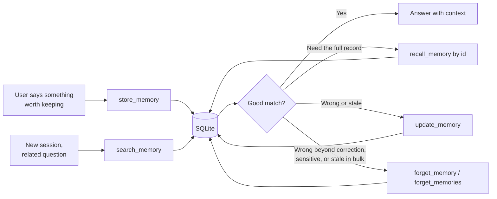

# MCP tools

localmem-mcp exposes eight tools. Seven are the core loop — store, search,
recall, list, update, and the two forget tools — and one reports on the database
itself.

Tool descriptions are written for the model, not for you: each docstring says
when to reach for the tool *and when not to*. That's why `recall_memory`
explicitly points at `search_memory` for meaning-based lookup.

---

## `store_memory`

Save something worth remembering across sessions.

```python
store_memory(
    content: str,
    tags: list[str] | None = None,
    source: str | None = None,
) -> dict
```

| Argument | Type | Default | Description |
| --- | --- | --- | --- |
| `content` | `str` | *required* | The memory itself, written so it makes sense on its own later. |
| `tags` | `list[str]` | `None` | Labels for filtering, e.g. `["project-x", "preference"]`. |
| `source` | `str` | `None` | Where it came from — `"conversation"`, a file path, a URL. |

**Returns** the stored memory, including the `id` needed to recall it directly:

```json
{
  "id": 1,
  "content": "We chose SQLite over Postgres because it ships in a single file",
  "tags": ["decision", "architecture"],
  "source": "conversation",
  "metadata": {},
  "created_at": "2026-08-14T11:31:00+00:00",
  "updated_at": "2026-08-14T11:31:00+00:00"
}
```

!!! note "Tags are normalized"

    Tags are lowercased, trimmed, and de-duplicated while preserving order, so
    `["Decision", " decision ", "Architecture"]` is stored as
    `["decision", "architecture"]`.

Empty or whitespace-only content raises an error — that's a caller bug, not a
recoverable state.

---

## `search_memory`

Find memories by meaning.

```python
search_memory(
    query: str,
    limit: int = 5,
    tags: list[str] | None = None,
    min_score: float = 0.0,
    offset: int = 0,
) -> dict
```

| Argument | Type | Default | Description |
| --- | --- | --- | --- |
| `query` | `str` | *required* | What you're trying to remember, in natural language. |
| `limit` | `int` | `5` | Maximum memories to return. |
| `tags` | `list[str]` | `None` | Only consider memories carrying **all** of these tags. |
| `min_score` | `float` | `0.0` | Drop results scoring below this, on a 0–1 scale. |
| `offset` | `int` | `0` | Skip this many ranked results before returning `limit` of them. |

**Returns** matches ranked by similarity, highest first:

```json
{
  "query": "what database are we using?",
  "count": 1,
  "offset": 0,
  "results": [
    {
      "id": 1,
      "content": "We chose SQLite over Postgres because it ships in a single file",
      "tags": ["decision", "architecture"],
      "source": "conversation",
      "metadata": {},
      "created_at": "2026-08-14T11:31:00+00:00",
      "updated_at": "2026-08-14T11:31:00+00:00",
      "score": 0.8213
    }
  ]
}
```

Scores are cosine similarity with a bounded keyword bonus, so they stay on a
0–1 scale — see [How search works](how-search-works.md). A blank query returns
no results rather than everything.

!!! tip "Choosing a `min_score`"

    Don't filter at all to start. If you get noise, `0.3`–`0.5` is a reasonable
    floor for "actually related". Thresholds are model-dependent, so tune
    against your own data rather than trusting a number from a doc.

Tag filtering is **conjunctive** — `tags=["work", "urgent"]` matches only
memories carrying both.

To page through more matches, repeat the search with the same `query` and
advance `offset` by `limit` — `limit=5, offset=5` returns results 6–10. Ranking
is deterministic (score descending, ties broken by id), so consecutive pages
neither overlap nor skip. A negative offset is clamped to `0`, and an offset
past the last match returns `"count": 0` rather than an error.

---

## `recall_memory`

Re-read a specific memory by id, or catch up on the most recent ones.

```python
recall_memory(
    memory_id: int | None = None,
    limit: int = 5,
) -> dict
```

| Argument | Type | Default | Description |
| --- | --- | --- | --- |
| `memory_id` | `int` | `None` | The id of a single memory to read back. Omit for recent ones. |
| `limit` | `int` | `5` | How many recent memories to return when `memory_id` is omitted. |

Two modes:

=== "By id"

    ```json
    { "found": true, "memory_id": 1, "memories": [ { "id": 1, "…": "…" } ] }
    ```

    A missing id returns `found: false` with an empty list rather than raising,
    so the agent can recover without a tool error.

    ```json
    { "found": false, "memory_id": 9999, "memories": [] }
    ```

=== "Most recent"

    ```json
    { "found": true, "count": 2, "memories": [ { "…": "…" }, { "…": "…" } ] }
    ```

    Newest first.

!!! info "This is not a search tool"

    `recall_memory` is for when you already know which memory you want — from a
    previous `store_memory` or `search_memory` call — or when you want a
    chronological catch-up. To find memories by meaning, use
    [`search_memory`](#search_memory).

---

## `list_memories`

Enumerate memories with tag filtering, ordering, and pagination without requiring a search query.

```python
list_memories(
    tags: list[str] | None = None,
    limit: int = 20,
    offset: int = 0,
    order: str = "newest",
) -> dict
```

| Argument | Type | Default | Description |
| --- | --- | --- | --- |
| `tags` | `list[str]` | `None` | Only consider memories carrying **all** of these tags. |
| `limit` | `int` | `20` | Maximum memories to return. |
| `offset` | `int` | `0` | Skip this many matching memories before returning `limit` of them. |
| `order` | `str` | `"newest"` | Sort order: `"newest"` or `"oldest"`. |

**Returns** matching memories and total count:

```json
{
  "count": 2,
  "total": 47,
  "offset": 0,
  "limit": 20,
  "order": "newest",
  "tags": ["decision"],
  "memories": [
    {
      "id": 1,
      "content": "We chose SQLite over Postgres because it ships in a single file",
      "tags": ["decision", "architecture"],
      "source": "conversation",
      "metadata": {},
      "created_at": "2026-08-14T11:31:00+00:00",
      "updated_at": "2026-08-14T11:31:00+00:00"
    }
  ]
}
```

Tag filtering is **conjunctive** — `tags=["work", "urgent"]` matches only memories carrying both.

Ordering is deterministic (`ORDER BY created_at DESC, id DESC` for `"newest"`, `ASC` for `"oldest"`), so pagination across pages with `limit` and `offset` neither repeats nor skips records.

!!! note "Database-only listing"

    `list_memories` performs filtering and pagination directly in SQL — it does not invoke embedding models, semantic search, or ranking.

---

## `update_memory`

Correct an existing memory in place.

```python
update_memory(
    memory_id: int,
    content: str | None = None,
    tags: list[str] | None = None,
    source: str | None = None,
) -> dict
```

| Argument | Type | Default | Description |
| --- | --- | --- | --- |
| `memory_id` | `int` | *required* | The id of the memory to correct. |
| `content` | `str` | `None` | The corrected text. When provided, the memory is re-embedded so search finds the correction. |
| `tags` | `list[str]` | `None` | Replacement tags. Omit to keep the current ones. |
| `source` | `str` | `None` | Replacement source. Omit to keep the current one. |

Only the arguments you pass are changed — a tag- or source-only call never
re-embeds, so it's instant. `created_at` is preserved; `updated_at` is
refreshed.

**Returns** the corrected memory, or `found: false` if the id doesn't exist:

```json
{ "found": true, "memory_id": 1, "memory": { "id": 1, "content": "…", "…": "…" } }
```

```json
{ "found": false, "memory_id": 9999, "memory": null }
```

!!! warning "This corrects, it doesn't add"

    Use `update_memory` when a stored memory is *wrong* — a misremembered fact,
    a misspelled name, a decision that has since changed. Editing the original
    record keeps one authoritative version instead of leaving the wrong one in
    search results. For something genuinely new, use
    [`store_memory`](#store_memory).

---

## `forget_memory`

Permanently delete one memory by id.

```python
forget_memory(
    memory_id: int,
) -> dict
```

| Argument | Type | Default | Description |
| --- | --- | --- | --- |
| `memory_id` | `int` | *required* | The id of the memory to delete. |

**Returns** whether the memory existed:

```json
{ "found": true, "memory_id": 7 }
```

A missing id returns `found: false` rather than raising, so the agent can
recover without a tool error:

```json
{ "found": false, "memory_id": 9999 }
```

!!! warning "This deletes, it doesn't correct"

    Use `forget_memory` when a memory is wrong beyond correction, sensitive, or
    simply no longer wanted. The delete is **hard** — the row is gone, not
    hidden. To fix a memory instead, use [`update_memory`](#update_memory).

---

## `forget_memories`

Permanently delete memories by tag and/or age.

```python
forget_memories(
    tags: list[str] | None = None,
    older_than_days: int | None = None,
) -> dict
```

| Argument | Type | Default | Description |
| --- | --- | --- | --- |
| `tags` | `list[str]` | `None` | Only delete memories carrying **all** of these tags. |
| `older_than_days` | `int` | `None` | Only delete memories created more than this many days ago. |

**At least one filter is required.** An unfiltered call is rejected so the
store can't be wiped by accident — a memory tool you can't prune becomes
landfill, but one that deletes everything on a typo is worse.

**Returns** the number of memories removed, plus the filters that matched them:

```json
{ "count": 12, "tags": ["scratch"], "older_than_days": null }
```

Deletion is hard: matching rows are gone, not hidden, and the FTS5 search index
stays consistent automatically.

!!! tip "Prune on a schedule"

    Stale facts outrank current ones over time. A periodic
    `forget_memories(older_than_days=90)` keeps the store honest without
    touching anything recent.

---

## `memory_stats`

Report where memories are stored, how many there are, and which model is in use.

```python
memory_stats() -> dict
```

```json
{
  "db_path": "/Users/you/.localmem/memories.db",
  "memories": 42,
  "embedding_model": "BAAI/bge-small-en-v1.5"
}
```

Useful for the agent to orient itself, and the first thing to check when
memories seem to be missing — usually the answer is that a different database is
configured than the one you expected.

---

## Typical flow



## Writing memories that stay useful

The tools work regardless, but a memory is only as good as its content:

- **Self-contained beats terse.** "Use the staging bucket" means nothing in six
  months. "Deploy artifacts go to the `acme-staging` S3 bucket, not `acme-prod`"
  still works.
- **Store decisions with their reasoning.** The *why* is what stops the same
  debate happening twice.
- **Durable, not transient.** Preferences, architecture choices, constraints,
  people's names — not "the build is running".
- **Tag by context**, so unrelated projects don't pollute each other's results.
