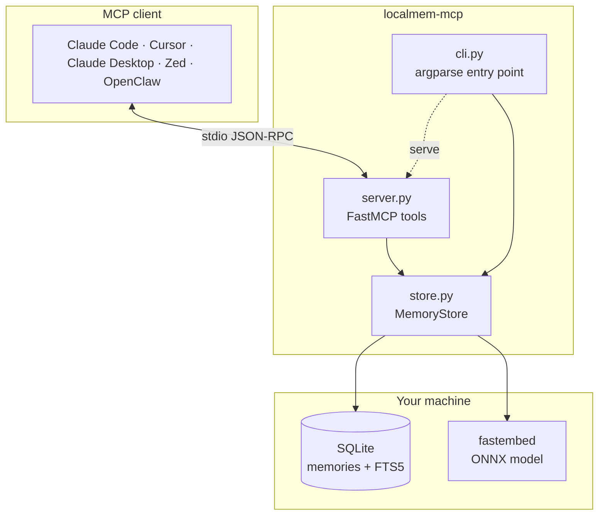

# Architecture

The whole project is about 700 lines. This page walks the design end to end.

## The shape of it



`store.py` is the project. `server.py` and `cli.py` are thin adapters that
translate MCP calls and command-line arguments into `MemoryStore` method calls.

## Storage

One table holds everything:

```sql
CREATE TABLE memories (
    id              INTEGER PRIMARY KEY AUTOINCREMENT,
    content         TEXT    NOT NULL,
    tags            TEXT    NOT NULL DEFAULT '',   -- comma-joined, normalized
    source          TEXT,
    metadata        TEXT    NOT NULL DEFAULT '{}', -- JSON
    created_at      TEXT    NOT NULL,              -- ISO-8601 UTC
    updated_at      TEXT    NOT NULL,
    embedding       BLOB,                          -- float32 vector
    embedding_model TEXT,
    dim             INTEGER
);
```

Plus an FTS5 virtual table over `content` and `tags`, in external-content mode,
kept in sync by `AFTER INSERT`, `AFTER DELETE`, and `AFTER UPDATE` triggers.

### Why embeddings live on the row

The alternative is a dedicated vector database alongside SQLite. Keeping the
vector as a `float32` blob on the same row means:

- **A memory is one row.** One insert, one delete, no partial-failure state
  where the text exists but its vector doesn't.
- **No second thing to install.** The privacy story stays "it's a file you own",
  literally.
- **Backup is `cp`.** No coordinated snapshot across two systems.

The cost is that search scans rather than indexes — a trade
[examined here](../guide/how-search-works.md#why-a-full-table-scan).

### Why the model name and dimension are stored

Nothing reads `embedding_model` or `dim` today. They're recorded because the
alternative — discovering a database was built with a different model and having
no way to tell which rows are affected — is unrecoverable.

With them, a future migration can re-embed selectively. And `_cosine` returns
`0.0` on a dimension mismatch rather than raising, so a mixed-model database
degrades quietly instead of crashing mid-session.

### Connection settings

```python
PRAGMA journal_mode=WAL
PRAGMA synchronous=NORMAL
```

WAL so a reader isn't blocked by a writer — you can run `localmem-mcp stats` in
a terminal while an agent holds the database open. `synchronous=NORMAL` because
losing the last few milliseconds of writes in a power failure is an acceptable
trade for a personal memory tool.

Writes are guarded by a `threading.Lock`, and the connection is opened with
`check_same_thread=False`, because FastMCP may dispatch tool calls from
different threads.

## The embedding layer

```python
class Embedder(Protocol):
    name: str
    def embed(self, texts: Sequence[str]) -> list[list[float]]: ...
```

The default implementation wraps fastembed and loads its model **lazily** — on
first `embed()`, not at import:

```python
def _ensure_model(self):
    if self._model is None:
        with self._lock:
            if self._model is None:
                from fastembed import TextEmbedding
                self._model = TextEmbedding(model_name=self.name, ...)
    return self._model
```

MCP clients often spawn every configured server at startup. Loading a 90 MB ONNX
model at import would stall the client's boot; loading on first use moves that
cost to a moment when the user is already waiting for an answer. The
double-checked lock keeps concurrent first calls from racing.

Making the embedder a protocol rather than a hard dependency is what lets the
test suite run offline in about a second, using a deterministic bag-of-words
stub. It's also the extension point for alternate backends.

## Search

Covered in depth in [How search works](../guide/how-search-works.md). The short
version:

```python
score = min(1.0, cosine_similarity + 0.25 * keyword_score)
```

Dense embeddings catch paraphrase; FTS5 catches the error codes and proper nouns
that embeddings handle badly. The bonus is additive rather than a weighted
average, so scores stay on the 0–1 cosine scale and `min_score` means the same
thing for every query.

## The server layer

```python
mcp = FastMCP("localmem", instructions=...)

@mcp.tool
def store_memory(content: str, tags: list[str] | None = None, ...) -> dict:
    """Save something worth remembering across sessions. …"""
    return get_store().add(content=content, tags=tags, source=source).to_dict()
```

Two things are load-bearing here:

**Docstrings are the interface.** FastMCP turns them into the tool descriptions
the model reads when deciding what to call. They're written as prompts — saying
when to use a tool *and when not to* — which is why the project treats a
docstring edit as a behaviour change.

**The store is module-level and lazy.** `get_store()` opens it on first use;
`configure()` replaces it. That indirection is what lets the CLI point the
server at a specific database and lets tests inject an offline embedder.

## Error philosophy

The distinction is whether the caller can do something about it:

- `add("")` raises `ValueError`. Empty content is a bug in the caller.
- `recall_memory(9999)` returns `{"found": false, "memories": []}`. The agent
  asked a reasonable question and gets a usable answer, no tool-error round trip.
- Missing FTS5 support degrades to pure vector search rather than failing.
- A dimension mismatch scores `0.0` rather than raising.

For an agent, a structured "nothing there" is far more useful than an exception.

## Testing

**25 tests, about 1.5 seconds, offline by default.**

`tests/test_store.py` runs against `StubEmbedder`, a bag-of-words vectorizer over
a small fixed vocabulary, built so "sqlite" lands nearer "database" than
"coffee". That's enough structure to assert genuine ranking behaviour with no
model download.

`tests/test_server.py` drives the tools through `fastmcp.Client(server)`
in-memory — the same path a real client takes, so it catches schema and
serialization problems that calling the functions directly would miss.

One test exercises the real model, skipped unless `LOCALMEM_TEST_FASTEMBED=1`.
CI runs it on every pull request.

## Deliberate non-goals

- **No cloud sync.** It would undo the entire premise.
- **No ANN index**, until scale demands it — and then behind the same `search()`
  signature, not a new API.
- **No agent framework features.** This is a memory tool.
- **No encryption at rest.** Key management belongs at the filesystem layer.
  See the [privacy model](../guide/privacy.md#memories-are-stored-unencrypted).

## Reading the source

If you want to understand the project, read `store.py` — everything else is a
shell over it. Within it, the parts that carry the most weight:

| Location | Why it matters |
| --- | --- |
| `MemoryStore.search` | The hybrid scoring blend |
| `_fts_query` | The one place untrusted input meets a query language |
| `_SCHEMA` triggers | External-content FTS5 needs all three to stay consistent |
| `_pack` / `_unpack` | The `float32` round-trip through the BLOB column |
| `FastEmbedEmbedder._ensure_model` | The lazy-load pattern |
